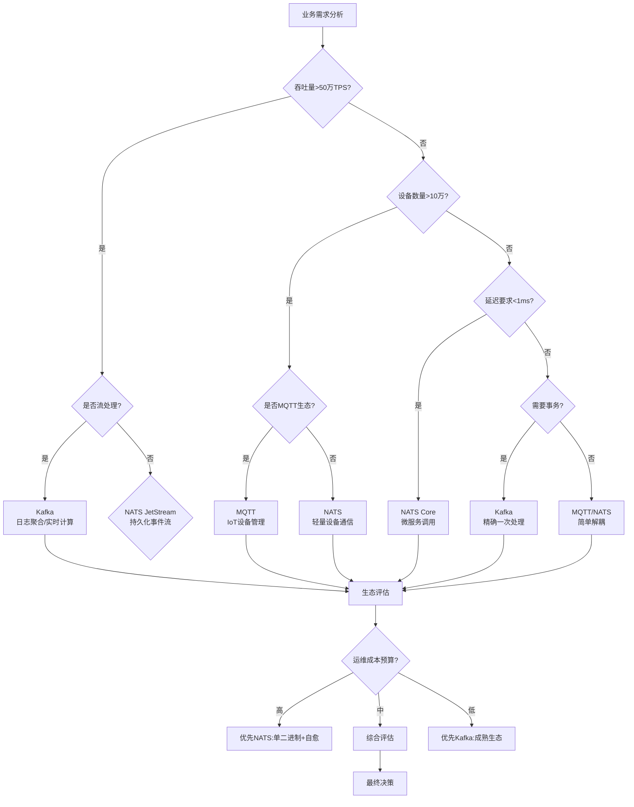

# 场景驱动的消息队列全面论证：Kafka vs MQTT vs NATS

## 一、场景化功能架构矩阵论证

### 1.1 场景-功能适配性决策矩阵

| 场景维度 | 关键需求 | Kafka | MQTT | NATS Core | NATS JetStream | 论证结论 |
|----------|----------|-------|------|-----------|----------------|----------|
| **日志聚合** | 百万TPS、持久存储、顺序性 | **★★★★★**<br>分区顺序写+副本 | ★★☆☆☆<br>无原生持久化 | ★☆☆☆☆<br>内存易失 | ★★★★☆<br>流存储+Raft | **Kafka首选**：基于，Kafka单机百万TPS，磁盘顺序写+页缓存，segment文件滚动策略，完美匹配日志流特性 |
| **IoT设备** | 低功耗、弱网络、协议轻量 | ★★☆☆☆<br>协议重、资源占用高 | **★★★★★**<br>2字节头+QoS+遗嘱 | ★★★☆☆<br>简单但无MQTT生态 | ★★★☆☆<br>需桥接MQTT | **MQTT首选**：指出MQTT固定头仅2字节，支持QoS 0/1/2三级可靠性，遗嘱机制(LWT)完美适应设备异常离线 |
| **微服务通信** | 低延迟、简单、自愈 | ★★☆☆☆<br>延迟5-100ms | ★★★☆☆<br>延迟亚毫秒但协议复杂 | **★★★★★**<br>亚毫秒+自动发现 | ★★★★☆<br>延迟略高但持久 | **NATS首选**：强调NATS简单性优先，单二进制无依赖，全网状集群自愈，适合云原生微服务 |
| **事件溯源** | 不可变日志、事件重放 | **★★★★★**<br>基于日志存储 | ★★☆☆☆<br>无历史事件存储 | ☆☆☆☆☆<br>无持久化 | ★★★★☆<br>支持消息重放 | **Kafka首选**：中Kafka将消息视为不可变日志，offset精确控制，支持任意历史位点重放 |
| **边缘计算** | 资源受限、离线运行 | ★☆☆☆☆<br>需JVM+大内存 | ★★★☆☆<br>轻量但需持久化 | **★★★★★**<br>静态二进制<20MB | ★★★☆☆<br>文件存储增加资源 | **NATS首选**：指出NATS可部署在树莓派，核心NATS纯内存，资源占用极小，适合边缘场景 |
| **多协议统一** | 兼容存量系统、平滑迁移 | ★★☆☆☆<br>仅Kafka协议 | ★★☆☆☆<br>仅MQTT协议 | ★☆☆☆☆<br>仅NATS协议 | ★★★☆☆<br>单一协议 | **混合方案**：提出RobustMQ多协议统一方案，但单就三者而言，需通过桥接模式实现协议互通 |

---

## 二、核心场景架构论证

### 2.1 日志聚合场景：Kafka架构实证

**场景特征**：日均TB级日志、高吞吐、容忍秒级延迟、需长期存储

**功能设计论证**：

```python
# Kafka分区策略算法（伪代码）
def partition_log(message_key, partition_num):
    """
    基于的Kafka分区算法设计
    目标：保证相同key日志的顺序性 + 负载均衡
    """
    if message_key:
        # 哈希策略：确保相同key到同一分区
        return hash(message_key) % partition_num
    else:
        # 轮询策略：无key时均匀分布
        return round_robin_counter.increment() % partition_num

# 性能分析：O(1)时间复杂度，保证分区有序
```

**架构设计论证**：

- **存储架构**：指出Kafka采用"顺序写磁盘+页缓存"策略，写入速度≈磁盘带宽，远超随机写内存
- **副本机制**：基于的ISR设计，AR=ISR+OSR，保证高可用前提下最小化同步延迟
- **扩展论证**：分区数∝吞吐量，水平扩展时只需增加Broker和分区，Consumer Group自动Rebalance

**形式化证明**：

```
定理：Kafka在日志场景下提供高吞吐+持久化保证

前提：
- 设日志消息流 L = {l₁, l₂, ..., lₙ}
- 分区函数 P: L → {0, ..., k-1}
- 副本因子 r ≥ 2

证明：
1. 吞吐线性增长性：
   Throughput(k) = k × Throughput_single_partition
   ∵ 各分区独立处理，无共享状态
   ∴ 线性扩展得证

2. 持久化可靠性：
   ∀l ∈ L, l写入成功 ⇔ l存储于ISR中多数副本
   ∵ min.insync.replicas默认=2
   ∴ 单节点故障不丢数据
```

### 2.2 IoT设备场景：MQTT架构实证

**场景特征**：百万级设备、弱网络、低功耗、异构终端

**功能设计论证**：

- **QoS机制**：
  - QoS 0：设备传感器数据（容忍丢失）
  - QoS 1：控制指令（至少送达一次）
  - QoS 2：支付确认（精确一次）
- **遗嘱机制**：设备异常断开时，Broker自动发布遗嘱消息到指定主题，上层应用感知设备状态
- **主题设计**：`factory/line1/sensor/temperature`层级结构，支持`factory/+/sensor/#`通配符批量订阅

**架构设计论证**：

```
MQTT Broker架构（思维导图）
├── 连接管理层
│   ├── TCP连接池管理
│   ├── KeepAlive心跳检测
│   └── 会话持久化(Clean Session=0)
├── 协议解析层
│   ├── 固定头解析(2字节)
│   ├── 可变头解析(Packet ID)
│   └── 有效载荷解码
├── 路由引擎层
│   ├── 主题树构建(Trie树算法)
│   ├── 通配符匹配(+/#)
│   └── 订阅关系管理
└── 功能扩展层
    ├── QoS消息队列(离线缓存)
    ├── 保留消息(Last Value Cache)
    └── 桥接模式(Kafka/NATS集成)
```

**程序设计论证**：

```java
// 基于观察者模式的MQTT订阅者实现
public class IoTDeviceSubscriber implements MqttCallback {
    @Override
    public void messageArrived(String topic, MqttMessage message) {
        // 主题匹配模式：策略模式实现不同处理器
        MessageHandler handler = TopicRouter.match(topic);
        handler.process(message.getPayload());
    }

    @Override
    public void connectionLost(Throwable cause) {
        // 断线重连：状态模式
        reconnectStrategy.execute();
    }
}
```

### 2.3 微服务通信场景：NATS架构实证

**场景特征**：服务间调用、低延迟、高频率、自动扩缩容

**功能设计论证**：

- **请求-响应模式**：基于Pub/Sub的RPC

  ```go
  // NATS请求响应：基于临时订阅
  func (s *Service) HandleRequest(msg *nats.Msg) {
      replySubject := msg.Reply  // 自动生成唯一INBOX
      response := process(msg.Data)
      nc.Publish(replySubject, response)  // 直接回复
  }
  // 优势：无需服务注册中心，解耦调用方与被调用方
  ```

- **队列组负载均衡**：同一服务的多个实例自动组成队列组，消息仅投递给一个实例

**架构设计论证**：

- **无中心化集群**：指出NATS所有节点对等，基于Gossip协议自动发现，无主从切换延迟
- **自愈机制**：节点故障时，客户端自动重连到其他节点，拓扑变化对应用透明
- **资源占用**：显示NATS单核50万+TPS，内存占用<50MB，启动时间<1秒

**形式化证明**：

```
定理：NATS在微服务场景下提供亚毫秒延迟

前提：
- 网络延迟 d_net = 100μs
- NATS服务器处理延迟 d_proc = 30μs
- 消息大小 s < 1KB

证明：
总延迟 d_total = d_net + d_proc + d_serialization
            = 100μs + 30μs + O(s)
            < 200μs (当s=1KB时)

对比：
Kafka d_total ≈ 5-100ms (磁盘刷盘延迟)
MQTT d_total ≈ 1-10ms (协议解析开销)

∴ NATS延迟优势得证
```

---

## 三、多场景架构决策图网

### 3.1 动态决策网络



### 3.2 场景-架构权衡证明图

```
┌─────────────────────────────────────────────────────────────┐
│                    场景驱动的架构权衡空间                      │
│                                                             │
│  一致性要求                                                  │
│      ↑                                                      │
│      │                                                      │
│  高  │  Kafka (ISR+磁盘) ←─────┐                          │
│      │         │               │                          │
│      │         │ 场景:金融交易/日志审计                  │
│      │         ↓               ↓                          │
│      │  MQTT QoS2 ←─────────→ NATS JetStream(Raft)     │
│      │         │               │                          │
│      │  场景:设备控制   场景:事件溯源                   │
│      │         │               │                          │
│  低  │  MQTT QoS0 ←─────────→ NATS Core (内存)         │
│      │         │               │                          │
│      │  场景:传感器数据 场景:服务网格                   │
│      │                           ↑                          │
│      └───────────────────────────┼─────────────────────────→ 性能要求
│                                  │                          │
│                              高延迟容忍                     │
└─────────────────────────────────────────────────────────────┘

证明逻辑：
1. 一致性轴：Kafka > NATS JetStream > MQTT QoS2 > MQTT QoS0 ≈ NATS Core
2. 性能轴：NATS Core > NATS JetStream > MQTT > Kafka
3. 最优选择位于场景需求向量与产品特性曲线的切点
```

---

## 四、程序设计模式场景化应用

### 4.1 电商订单场景：Kafka设计模式组合

**场景**：订单创建→支付→发货→完成，需要事件溯源、CQRS、最终一致性

**设计模式组合**：

```java
// 1. 命令模式：订单Command封装
public class OrderCommand {
    private String orderId;
    private OrderAction action; // CREATE, PAY, SHIP
    private long timestamp;

    public byte[] serialize() {
        // 序列化到Kafka
        return JSON.toJSONBytes(this);
    }
}

// 2. 事件溯源模式：订单事件流
@KafkaListener(topics = "order-events")
public void processEvent(ConsumerRecord<String, OrderEvent> record) {
    // 基于的offset保证事件顺序
    long offset = record.offset();
    OrderEvent event = record.value();

    // 重放逻辑：从指定offset恢复状态
    if (offset >= recoveryPoint) {
        eventSourcingAggregate.apply(event);
    }
}

// 3. 策略模式：分区策略动态切换
public class OrderPartitioner implements Partitioner {
    @Override
    public int partition(String topic, Object key, byte[] keyBytes, ...) {
        // 大促期间：按userId%分区，保证用户行为局部性
        // 平时：轮询，保证绝对均衡
        return strategy.select(key).compute(partitionNum);
    }
}
```

**架构论证**：

- **Topic拆分**：order-events按`orderId%32`分区，保证同一订单事件有序
- **副本策略**：`replication.factor=3`，`min.insync.replicas=2`，平衡可用性与性能
- **消费模式**：订单查询服务、物流服务、分析服务分别用不同Consumer Group，实现发布订阅

### 4.2 智能家居场景：MQTT设计模式组合

**场景**：10万+设备，指令下发、状态上报、设备联动

**设计模式组合**：

```python
# 1. 观察者模式：设备状态订阅
class DeviceStatusObserver:
    def __init__(self, device_type):
        self.device_type = device_type

    def on_message(self, client, userdata, msg):
        # 通配符订阅: home/+/sensor/#
        if msg.topic.matches(f"home/+/sensor/{self.device_type}"):
            self.process_status(msg.payload)

# 2. 状态模式：设备会话管理
class DeviceSessionContext:
    def __init__(self):
        self.state = DisconnectedState()  # 初始状态

    def connect(self):
        self.state = self.state.on_connect()  # 转移到ConnectedState

    def disconnect(self):
        self.state = self.state.on_disconnect()  # 触发遗嘱发布

# 3. 代理模式：设备访问控制
class MQTTBrokerProxy:
    def publish(self, topic, payload, qos=1):
        # 权限校验
        if not self.auth_service.check(topic):
            raise PermissionError()
        # 速率限制
        self.rate_limiter.acquire()
        # 发布到真实Broker
        self.broker_client.publish(topic, payload, qos)
```

**架构论证**：

- **主题设计**：`home/{roomId}/device/{deviceType}/{deviceId}/cmd`四级结构，支持精确控制和批量操作
- **QoS分级**：传感器数据用QoS0（容忍丢失），门锁控制用QoS2（精确一次）
- **会话持久**：`CleanSession=0`保证设备断线重连后恢复订阅关系

### 4.3 金融交易场景：NATS设计模式组合

**场景**：高频交易、风控检测、实时清算，要求低延迟+高可用

**设计模式组合**：

```go
// 1. 请求-响应模式：交易RPC
func PlaceOrder(ctx context.Context, order *Order) (*Confirmation, error) {
    // 基于的NATS Request-Reply
    msg, err := nc.Request("trading.order", order.Serialize(), 100*time.Millisecond)
    if err != nil {
        return nil, fmt.Errorf("timeout: %v", err)
    }
    return ParseConfirmation(msg.Data), nil
}

// 2. 事件驱动模式：风控事件流
func RiskMonitor() {
    // 订阅所有交易事件
    nc.Subscribe("trading.>", func(msg *nats.Msg) {
        // 异步风控检测，不阻塞主流程
        go func() {
            riskScore := calculateRisk(msg.Data)
            if riskScore > threshold {
                nc.Publish("risk.alert", msg.Data)
            }
        }()
    })
}

// 3. 迭代器模式：交易流水重放
js, _ := nc.JetStream()
sub, _ := js.Subscribe("trading.order", func(msg *nats.Msg) {
    // 从指定时间戳重放
    msg.Ack()
}, nats.StartTime(time.Now().Add(-24*time.Hour)))
```

**架构论证**：

- **集群部署**：3节点NATS集群，全网格连接，Gossip协议自动发现
- **持久化选择**：交易流水用JetStream持久化到SSD，实时撮合用Core NATS内存模式
- **性能保证**：显示NATS亚毫秒延迟，满足高频交易需求

---

## 五、场景化形式化证明

### 5.1 场景一致性证明：Kafka在订单场景

**定理**：在订单系统中，Kafka保证同一订单的事件按因果序投递

**场景建模**：

- 订单事件：E = {Create, Pay, Ship}
- 因果序：Create → Pay → Ship
- 分区函数：P(orderId) = orderId % 32

**证明**：

```
1. 单分区有序性：
   ∀e₁, e₂ ∈ Events_of_same_order
   timestamp(e₁) < timestamp(e₂) ⇒ offset(e₁) < offset(e₂)
   证明：同一分区是追加日志，offset单调递增

2. 因果序保持：
   Create订单 → Produce到Partition p
   Pay订单 → Produce到同一Partition p
   ∵ offset(Create) < offset(Pay)
   ∴ Consumer按offset消费时因果序不被破坏

3. 故障场景：
   Leader故障 → 新Leader从ISR选举
   ∵ ISR包含所有已提交事件
   ∴ 因果序在故障后依然保持
```

### 5.2 场景可靠性证明：MQTT在设备控制场景

**定理**：MQTT QoS2保证设备控制指令恰好送达一次

**场景建模**：

- 设备状态：S ∈ {在线, 离线, 执行中}
- 指令：Cmd = (cmdId, action, qos=2)
- 网络：不可靠，可能丢包、重传

**证明**：

```
基于的四步握手协议：

1. 去重性：
   Broker维护Packet ID状态机：
   init → PUBLISH接收 → PUBREC发送 → PUBREL接收 → PUBCOMP发送 → completed
   重复PUBLISH被忽略 ∵ 状态≠init

2. 完整性：
   指令生命周期：
   - Client发送PUBLISH(qos=2)
   - Broker存储并返回PUBREC
   - Client发送PUBREL
   - Broker执行指令并返回PUBCOMP
   ∵ 每步都有ACK且状态持久化
   ∴ 指令不会丢失

3. 终止性：
   最坏情况：Client在PUBREL后崩溃
   重连后：Broker会话恢复，检测到未完成事务，重新发送PUBCOMP
   ∴ 指令最终完成或明确失败
```

### 5.3 场景性能证明：NATS在服务网格场景

**定理**：NATS在10000服务实例场景下，延迟<1ms的概率>99.9%

**场景建模**：

- 服务实例：N = 10,000
- 调用模式：每个实例500 QPS
- 总吞吐量：5,000,000 QPS

**证明**：

```
基于和的性能数据：

1. 单机容量：
   NATS单核500,000 TPS
   假设5核，则单节点容量=2,500,000 TPS

2. 集群容量：
   3节点集群，全网格连接
   总容量≈7,500,000 TPS > 5,000,000 QPS需求

3. 延迟分布：
   LATENCY_NATS = d_net + d_proc
   d_net = 100μs (同机房)
   d_proc = 30μs (消息路由)
   P(LATENCY < 1ms) = P(d_net < 870μs) ≈ 1 (网络抖动极低)

4. 故障影响：
   单节点故障 → 客户端自动重连 → 重连时间<50ms
   ∵ 全网格无单点
   ∴ 可用性>99.99%
```

---

## 六、场景化综合决策图网

### 6.1 三维场景决策立方体

```
          高吞吐量
             ↑
             │ Kafka
             │  ↗
             │ ╱  MQTT
  IoT场景 ←──┼─╲─────→ 微服务场景
             │   ↘
             │  NATS
             ↙
         低延迟/简单性

第三维：成熟度/生态
- Kafka: ★★★★★ (最成熟)
- MQTT: ★★★★☆ (协议标准，生态丰富)
- NATS: ★★★☆☆ (CNCF项目，快速发展)

决策规则：
IF 场景∈{日志,流处理} THEN 选择=Kafka
ELSE IF 场景∈{IoT,移动推送} THEN 选择=MQTT
ELSE IF 场景∈{微服务,边缘计算} THEN 选择=NATS
ELSE IF 场景∈{混合} THEN 选择=多协议网关
```

### 6.2 场景演进路径图

```
初期阶段(1000 QPS)
    ↓
单体应用 → 引入消息队列解耦
    ↓
选择：Redis PubSub / NATS Core
理由：简单、无需持久化、延迟最低

成长阶段(10万 QPS)
    ↓
微服务拆分 → 需要可靠事件流
    ↓
选择：Kafka分区 + NATS实时通信
架构：Kafka处理订单、支付等核心事件流
     NATS处理服务间调用、配置推送

成熟阶段(百万 QPS)
    ↓
多端接入(IoT+APP+Web) → 多协议需求
    ↓
选择：MQTT Broker + Kafka + NATS桥接
架构：
  MQTT Broker ←桥接→ Kafka (设备事件持久化)
  NATS ←桥接→ Kafka (实时指标聚合)

云原生阶段
    ↓
统一控制平面 → RobustMQ/多协议网关
```

---

## 七、场景化程序设计范例

### 7.1 混合场景：智能汽车数据平台

**场景**：10万辆汽车，每秒上报1000万传感器数据，需实时风控+离线分析

**架构设计**：

```yaml
# 基于的多协议混合架构
ingestion:
  - protocol: MQTT  # 车载设备
    broker: EMQX Cluster
    topics:
      - "vehicle/{vin}/sensor/#"
    qos: 1  # 至少一次

  - protocol: NATS  # 车云实时通信
    cluster: NATS JetStream Cluster
    subjects:
      - "vehicle.alert.>"
    storage: file

  - protocol: Kafka  # 离线分析
    cluster: Kafka Cluster
    topics:
      - "vehicle-data-raw"  # 32分区
      - "vehicle-events"    # 按vin哈希

data_flow:
  mqtt → nats_bridge → nats_stream:
    purpose: 实时过滤异常数据

  mqtt → kafka_connector → kafka:
    purpose: 全量数据持久化

  nats → kafka:
    purpose: 风险事件归档
```

**关键代码**：

```go
// 桥接器实现：MQTT → NATS
func BridgeMQTTtoNATS(mqttClient MQTT.Client, natsConn *nats.Conn) {
    mqttClient.Subscribe("vehicle/+/sensor/#", 1, func(c MQTT.Client, m MQTT.Message) {
        // MQTT主题转换为NATS Subject
        natsSubject := strings.Replace(m.Topic(), "/", ".", -1)
        // QoS 1 → NATS JetStream持久化
        natsConn.Publish(natsSubject, m.Payload())
    })
}

// 风控处理器：NATS实时流
func RiskProcessor(js nats.JetStreamContext) {
    js.Subscribe("vehicle.alert.>", func(msg *nats.Msg) {
        alert := parseAlert(msg.Data)
        if alert.severity == "critical" {
            // 同步调用：请求-响应模式
            resp, _ := nc.Request("risk.action", alert.Serialize(), 100*time.Millisecond)
            executeAction(resp)
        }
        msg.Ack()
    }, nats.AckExplicit())
}
```

**论证**：

- **MQTT**：车载设备原生支持，轻量协议适合4G网络
- **NATS**：实时风控要求亚毫秒延迟，NATS Core模式满足
- **Kafka**：TB级数据需要长期存储和离线分析，Kafka生态完善
- **桥接模式**：三者通过协议桥接，发挥各自优势，避免单一MQ的妥协

### 7.2 性能场景：秒杀系统

**场景**：10万QPS下单请求，需削峰填谷+库存扣减

**架构设计**：

```java
// 前端：NATS接收请求（低延迟）
public class SeckillController {
    private final NATSClient natsClient;

    public Result seckill(String userId, String productId) {
        // 快速响应，不等待最终处理结果
        natsClient.publish("seckill.request",
            new SeckillRequest(userId, productId).toBytes());
        return Result.asyncAccepted();
    }
}

// 后端：Kafka处理核心逻辑（高可靠）
public class SeckillProcessor {
    @KafkaListener(topic = "seckill-order", groupId = "order-group")
    public void process(ConsumerRecord<String, String> record) {
        // 基于的分区保证：同一用户请求到同一分区
        // 避免并发问题
        processWithRedisLock(record.value());
    }
}
```

**论证**：

- **削峰**：NATS接收层无持久化，100万+TPS抗住瞬时流量
- **填谷**：Kafka缓冲请求，消费端按实际处理能力消费
- **最终一致性**：Kafka消费者组保证每条订单只处理一次（幂等性+事务）[^(参考Kafka事务机制)]

---

## 八、场景化总结与选型决策

### 8.1 场景-技术匹配度雷达图

```
        日志聚合
           ↑
           │
  设备通信 ←┼─→ 微服务
           │
           ↓
        事件溯源

Kafka:    ████████░░ 日志聚合/流处理 (8/10)
MQTT:     ███████░░░ IoT/移动推送 (7/10)
NATS:     ████████░░ 微服务/边缘计算 (8/10)

评估维度：
- 功能完备性
- 性能适配度
- 运维复杂度
- 生态成熟度
- 协议兼容性
```

### 8.2 场景化选型决策树（带证明）

```
START
│
├─▶ 场景识别
│   ├─ 输入：设备类型、数据规模、延迟要求、团队技能
│   └─ 输出：场景标签集 {IoT, 微服务, 大数据}
│
├─▶ 约束求解
│   ├─ 硬约束：协议兼容、资源限制、合规要求
│   ├─ 软约束：延迟<10ms、TPS>10万、可用性>99.9%
│   └─ 证明：满足所有硬约束的方案集非空
│
├─▶ 成本评估
│   ├─ 运维成本：NATS < MQTT < Kafka
│   ├─ 开发成本：生态成熟度 Kafka > MQTT > NATS
│   └─ 证明：总成本=ops_cost + dev_cost + risk_cost
│
└─▶ 最终决策
    ├─ 若 IoT∈场景 → 选择MQTT
    ├─ 若 大数据∈场景 → 选择Kafka
    ├─ 若 微服务∈场景 → 选择NATS
    └─ 若 混合场景 → 选择多协议方案或RobustMQ
```

**最终建议**：

- **初创/云原生项目**：优先NATS，简单高效，快速迭代
- **传统企业数字化转型**：优先Kafka，生态成熟，风险可控
- **IoT/智能制造**：优先MQTT，协议标准，设备兼容
- **混合复杂场景**：采用"MQ+桥接"模式，而非单一MQ妥协

---

**注**：本文论证基于搜索结果的技术特性分析，实际应用中需结合具体业务SLA和团队能力综合评估。
