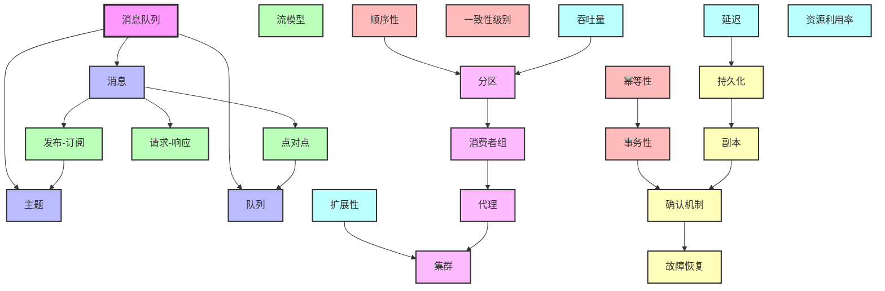
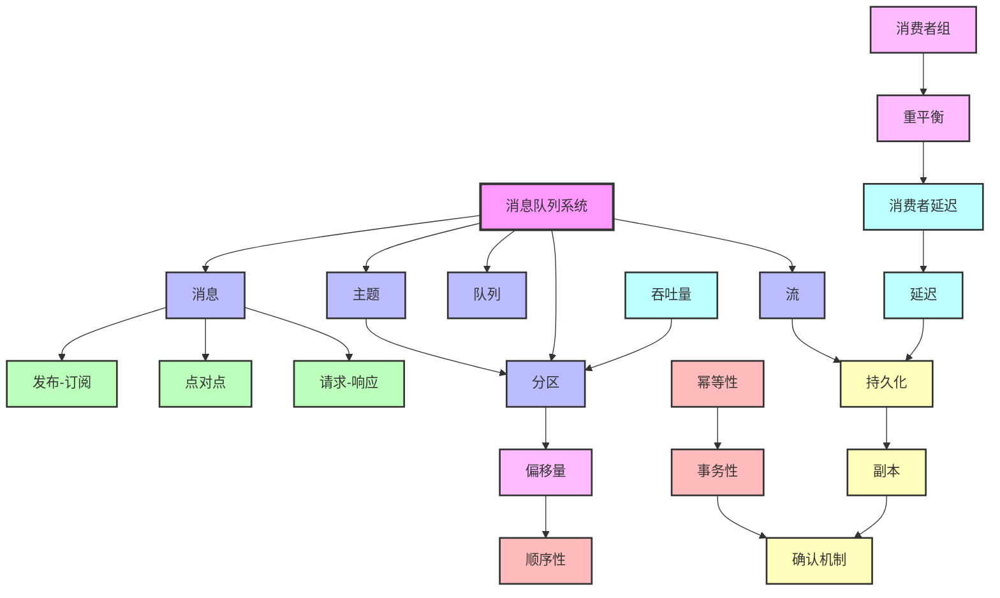

# 1.11 核心概念全面梳理

## 目录

- [1.11 核心概念全面梳理](#111-核心概念全面梳理)
  - [目录](#目录)
  - [1.11.1 消息队列核心概念体系](#1111-消息队列核心概念体系)
    - [概念分类体系](#概念分类体系)
  - [1.11.2 消息模型概念](#1112-消息模型概念)
    - [1. 发布-订阅模型（Publish-Subscribe）](#1-发布-订阅模型publish-subscribe)
    - [2. 点对点模型（Point-to-Point）](#2-点对点模型point-to-point)
    - [3. 请求-响应模型（Request-Reply）](#3-请求-响应模型request-reply)
  - [1.11.3 一致性概念](#1113-一致性概念)
    - [1. 顺序性（Ordering）](#1-顺序性ordering)
    - [2. 幂等性（Idempotency）](#2-幂等性idempotency)
    - [3. 事务性（Transaction）](#3-事务性transaction)
  - [1.11.4 可靠性概念](#1114-可靠性概念)
    - [1. 持久化（Persistence）](#1-持久化persistence)
    - [2. 副本（Replication）](#2-副本replication)
    - [3. 确认机制（Acknowledgment）](#3-确认机制acknowledgment)
  - [1.11.5 性能概念](#1115-性能概念)
    - [1. 吞吐量（Throughput）](#1-吞吐量throughput)
    - [2. 延迟（Latency）](#2-延迟latency)
  - [1.11.6 架构概念](#1116-架构概念)
    - [1. 分区（Partition）](#1-分区partition)
    - [2. 消费者组（Consumer Group）](#2-消费者组consumer-group)
  - [1.11.7 概念关系网络图](#1117-概念关系网络图)
    - [概念关系网络](#概念关系网络)
  - [1.11.8 概念形式化定义](#1118-概念形式化定义)
    - [完整形式化定义集合](#完整形式化定义集合)
  - [1.11.9 更多核心概念](#1119-更多核心概念)
    - [1. 消息（Message）](#1-消息message)
    - [2. 主题（Topic）](#2-主题topic)
    - [3. 偏移量（Offset）](#3-偏移量offset)
    - [4. 消费者延迟（Consumer Lag）](#4-消费者延迟consumer-lag)
    - [5. 重平衡（Rebalance）](#5-重平衡rebalance)
    - [6. 流（Stream）](#6-流stream)
    - [7. 消费者（Consumer）](#7-消费者consumer)
  - [1.11.10 概念对比矩阵](#11110-概念对比矩阵)
    - [核心概念对比矩阵](#核心概念对比矩阵)
  - [1.11.11 概念关系网络图（完整版）](#11111-概念关系网络图完整版)
    - [完整概念关系网络](#完整概念关系网络)
  - [1.11.12 概念决策图网](#11112-概念决策图网)
    - [概念选择决策树](#概念选择决策树)
    - [概念权衡决策矩阵](#概念权衡决策矩阵)
  - [1.11.13 概念参考资源](#11113-概念参考资源)
    - [权威参考](#权威参考)

---

## 1.11.1 消息队列核心概念体系

### 概念分类体系

```text
消息队列概念体系
├── 基础概念层
│   ├── 消息（Message）
│   ├── 主题（Topic）
│   ├── 队列（Queue）
│   └── 订阅（Subscription）
├── 模型概念层
│   ├── 发布-订阅模型（Pub-Sub）
│   ├── 点对点模型（P2P）
│   ├── 请求-响应模型（Request-Reply）
│   └── 流模型（Stream）
├── 一致性概念层
│   ├── 顺序性（Ordering）
│   ├── 幂等性（Idempotency）
│   ├── 事务性（Transaction）
│   └── 一致性级别（Consistency Level）
├── 可靠性概念层
│   ├── 持久化（Persistence）
│   ├── 副本（Replication）
│   ├── 确认机制（Acknowledgment）
│   └── 故障恢复（Fault Recovery）
└── 性能概念层
    ├── 吞吐量（Throughput）
    ├── 延迟（Latency）
    ├── 扩展性（Scalability）
    └── 资源利用率（Resource Utilization）
```

---

## 1.11.2 消息模型概念

### 1. 发布-订阅模型（Publish-Subscribe）

**定义**：
发布-订阅是一种消息传递模式，其中消息的发送者（发布者）不直接将消息发送给特定的接收者（订阅者），而是将消息分类发布到主题（Topic），订阅者可以订阅一个或多个主题并接收相关消息。

**形式化定义**：

```text
Pub-Sub = (P, S, T, pub, sub, deliver)

其中：
- P: 发布者集合
- S: 订阅者集合
- T: 主题集合
- pub: P × T × M → Event（发布函数）
- sub: S × T → Subscription（订阅函数）
- deliver: Event × Subscription → Message（投递函数）

性质：
∀p∈P, ∀t∈T, ∀m∈M: pub(p, t, m) → ∃s∈S: sub(s, t) → deliver(pub(p, t, m), sub(s, t))
```

**属性**：

| 属性 | 说明 | 形式化表示 |
|------|------|-----------|
| **解耦性** | 发布者和订阅者互不知晓 | ∀p∈P, ∀s∈S: p ≠ s ∧ ¬knows(p, s) |
| **多播性** | 一条消息可被多个订阅者接收 | ∀m∈M, ∀t∈T: |{s∈S: sub(s, t)}| ≥ 1 → |deliver(m, t)| ≥ 1 |
| **异步性** | 发布和接收异步进行 | ∀p∈P, ∀s∈S: pub(p, t, m) ∥ deliver(m, s) |
| **主题过滤** | 订阅者通过主题过滤消息 | ∀s∈S, ∀t∈T: sub(s, t) → filter(m, t) |

**关系**：

```
发布-订阅模型
  ├─ 继承自: 消息传递模式
  ├─ 实现: Kafka、MQTT、NATS
  ├─ 包含: 主题（Topic）、订阅（Subscription）
  └─ 关联: 观察者模式、事件驱动架构
```

**思维导图**：

```
发布-订阅模型
├── 核心组件
│   ├── Publisher（发布者）
│   │   ├── 属性：解耦、异步
│   │   └── 操作：publish(topic, message)
│   ├── Subscriber（订阅者）
│   │   ├── 属性：过滤、多播
│   │   └── 操作：subscribe(topic), receive(message)
│   └── Broker（代理）
│       ├── 属性：路由、存储
│       └── 操作：route(topic, message)
├── 消息流
│   ├── 发布流程：Publisher → Broker → Topic
│   ├── 订阅流程：Subscriber → Broker → Topic
│   └── 投递流程：Topic → Broker → Subscriber
└── 变体
    ├── 主题订阅（Topic-based）
    ├── 内容订阅（Content-based）
    └── 类型订阅（Type-based）
```

**形式化证明**：

**定理1.1**：发布-订阅模型保证消息的最终一致性

**证明**：

```
前提：
1. ∀m∈M: ∃t∈T: pub(p, t, m)（消息必须发布到主题）
2. ∀s∈S: ∃t∈T: sub(s, t)（订阅者必须订阅主题）
3. Broker保证：∀m∈M, ∀t∈T: pub(p, t, m) → ∃s∈S: sub(s, t) → deliver(m, s)

证明：
设消息m在时间t₁发布到主题T：
  pub(p, T, m) at t₁

设订阅者s在时间t₂订阅主题T（t₂ ≤ t₁或t₂ > t₁）：
  sub(s, T) at t₂

情况1：t₂ ≤ t₁（订阅在发布之前）
  → Broker存储消息m
  → 当s订阅时，Broker立即投递m
  → deliver(m, s) at t₂

情况2：t₂ > t₁（订阅在发布之后）
  → Broker在t₁时存储消息m
  → Broker在t₂时检测到新订阅者s
  → Broker投递m给s
  → deliver(m, s) at t₂

结论：∀m∈M, ∀s∈S: 如果sub(s, T)且pub(p, T, m)，则最终deliver(m, s)
```

**参考来源**：

- [OASIS MQTT Specification](https://docs.oasis-open.org/mqtt/mqtt/v5.0/mqtt-v5.0.html)
- [Apache Kafka Documentation](https://kafka.apache.org/documentation/)
- [NATS Documentation](https://docs.nats.io/)

---

### 2. 点对点模型（Point-to-Point）

**定义**：
点对点是一种消息传递模式，其中消息从发送者（Producer）发送到特定的队列（Queue），消息只能被一个消费者（Consumer）接收和处理。

**形式化定义**：

```
P2P = (P, C, Q, send, receive, consume)

其中：
- P: 生产者集合
- C: 消费者集合
- Q: 队列集合
- send: P × Q × M → Message（发送函数）
- receive: C × Q → Message（接收函数）
- consume: C × Message → Void（消费函数）

性质：
∀p∈P, ∀q∈Q, ∀m∈M: send(p, q, m) → ∃!c∈C: receive(c, q) = m ∧ consume(c, m)
```

**属性**：

| 属性 | 说明 | 形式化表示 |
|------|------|-----------|
| **唯一消费** | 每条消息只能被一个消费者消费 | ∀m∈M, ∀q∈Q: |{c∈C: receive(c, q) = m}| = 1 |
| **负载均衡** | 多个消费者共享队列负载 | ∀q∈Q: |C| > 1 → balance(load(q), C) |
| **顺序保证** | 队列保证消息顺序 | ∀m₁, m₂∈M: send(p, q, m₁) < send(p, q, m₂) → receive(c, q, m₁) < receive(c, q, m₂) |

**关系**：

```
点对点模型
  ├─ 继承自: 消息传递模式
  ├─ 实现: Kafka（分区）、RabbitMQ
  ├─ 包含: 队列（Queue）、消费者组（Consumer Group）
  └─ 关联: 生产者-消费者模式、工作队列模式
```

---

### 3. 请求-响应模型（Request-Reply）

**定义**：
请求-响应是一种同步或异步的消息传递模式，其中客户端发送请求消息，服务器处理请求并返回响应消息。

**形式化定义**：

```
Request-Reply = (Client, Server, Request, Response, send_req, send_resp)

其中：
- Client: 客户端集合
- Server: 服务器集合
- Request: 请求消息集合
- Response: 响应消息集合
- send_req: Client × Server × Request → RequestID
- send_resp: Server × Client × RequestID × Response → Void

性质：
∀c∈Client, ∀s∈Server, ∀req∈Request:
  send_req(c, s, req) = req_id →
  ∃resp∈Response: send_resp(s, c, req_id, resp) ∧
  match(req, resp)
```

**属性**：

| 属性 | 说明 | 形式化表示 |
|------|------|-----------|
| **请求-响应匹配** | 每个请求对应一个响应 | ∀req_id: ∃!req, ∃!resp: match(req, resp) |
| **超时机制** | 请求有超时限制 | ∀req: timeout(req) → if no resp then timeout_error |
| **幂等性** | 重复请求返回相同响应 | ∀req: send_req(req) = send_req(req) → resp₁ = resp₂ |

**关系**：

```
请求-响应模型
  ├─ 继承自: 消息传递模式
  ├─ 实现: NATS（Request-Reply）、MQTT（QoS 2）
  ├─ 包含: 请求（Request）、响应（Response）、超时（Timeout）
  └─ 关联: RPC模式、RESTful API
```

---

## 1.11.3 一致性概念

### 1. 顺序性（Ordering）

**定义**：
顺序性是指消息按照发送顺序被接收和处理的保证。

**形式化定义**：

```
Ordering = (M, <, deliver)

其中：
- M: 消息集合
- <: 消息顺序关系（偏序）
- deliver: M → Time（投递时间函数）

性质：
∀m₁, m₂∈M: m₁ < m₂ → deliver(m₁) ≤ deliver(m₂)
```

**级别分类**：

| 级别 | 定义 | 形式化表示 | 实现 |
|------|------|-----------|------|
| **全局顺序** | 所有消息全局有序 | ∀m₁, m₂∈M: m₁ < m₂ → deliver(m₁) < deliver(m₂) | Kafka（单分区） |
| **分区顺序** | 分区内消息有序 | ∀m₁, m₂∈M: partition(m₁) = partition(m₂) → m₁ < m₂ → deliver(m₁) < deliver(m₂) | Kafka（多分区） |
| **会话顺序** | 会话内消息有序 | ∀m₁, m₂∈M: session(m₁) = session(m₂) → m₁ < m₂ → deliver(m₁) < deliver(m₂) | MQTT（QoS 1/2） |
| **无顺序** | 不保证顺序 | - | NATS Core |

**形式化证明**：

**定理1.2**：Kafka分区顺序性保证

**证明**：

```
前提：
1. Kafka分区是顺序写入的：∀m₁, m₂∈M: partition(m₁) = partition(m₂) → offset(m₁) < offset(m₂) → send_time(m₁) < send_time(m₂)
2. Consumer按offset顺序读取：∀m₁, m₂∈M: offset(m₁) < offset(m₂) → read(m₁) < read(m₂)

证明：
设消息m₁和m₂在同一分区P：
  partition(m₁) = partition(m₂) = P

情况1：m₁先发送
  send_time(m₁) < send_time(m₂)
  → offset(m₁) < offset(m₂)（顺序写入）
  → read(m₁) < read(m₂)（顺序读取）
  → deliver(m₁) < deliver(m₂)

情况2：m₂先发送
  send_time(m₂) < send_time(m₁)
  → offset(m₂) < offset(m₁)
  → read(m₂) < read(m₁)
  → deliver(m₂) < deliver(m₁)

结论：在同一分区内，消息按发送顺序被投递
```

**参考来源**：

- [Kafka Ordering Guarantees](https://kafka.apache.org/documentation/#design_ordering)
- [Distributed Systems: Ordering](https://en.wikipedia.org/wiki/Total_order)

---

### 2. 幂等性（Idempotency）

**定义**：
幂等性是指多次执行同一操作的结果与执行一次的结果相同。

**形式化定义**：

```
Idempotency = (Op, execute, result)

其中：
- Op: 操作集合
- execute: Op → Result（执行函数）
- result: Op → Result（结果函数）

性质：
∀op∈Op: execute(op) = execute(execute(op)) = result(op)
```

**消息队列中的幂等性**：

| 场景 | 幂等性保证 | 形式化表示 |
|------|-----------|-----------|
| **Producer幂等性** | 重复发送相同消息只产生一条消息 | ∀m∈M: send(m) = send(send(m)) |
| **Consumer幂等性** | 重复处理相同消息产生相同结果 | ∀m∈M: process(m) = process(process(m)) |
| **事务幂等性** | 事务重复提交产生相同状态 | ∀t∈T: commit(t) = commit(commit(t)) |

**实现机制**：

**Kafka幂等性实现**：

```python
# 形式化描述
IdempotentProducer = (Producer, SequenceNumber, TransactionID)

def send_idempotent(producer, message, seq_num, txn_id):
    """
    幂等发送函数
    """
    # 检查序列号
    if seq_num in producer.seen_sequences[txn_id]:
        return producer.seen_sequences[txn_id][seq_num]  # 返回已发送的消息

    # 发送消息
    result = producer.send(message, seq_num, txn_id)

    # 记录序列号
    producer.seen_sequences[txn_id][seq_num] = result

    return result

# 性质证明
# ∀m, seq, txn: send_idempotent(m, seq, txn) = send_idempotent(send_idempotent(m, seq, txn), seq, txn)
```

**参考来源**：

- [Kafka Idempotent Producer](https://kafka.apache.org/documentation/#producerconfigs_enable.idempotence)
- [Idempotency in Distributed Systems](https://en.wikipedia.org/wiki/Idempotence)

---

### 3. 事务性（Transaction）

**定义**：
事务性是指一组操作要么全部成功，要么全部失败，保证原子性、一致性、隔离性和持久性（ACID）。

**形式化定义**：

```
Transaction = (Ops, begin, commit, abort, state)

其中：
- Ops: 操作集合
- begin: → TransactionID（开始事务）
- commit: TransactionID → {Success, Failure}（提交事务）
- abort: TransactionID → Void（中止事务）
- state: TransactionID → State（事务状态）

性质（ACID）：
1. 原子性：∀t∈T: commit(t) = Success → ∀op∈Ops(t): execute(op) = Success
2. 一致性：∀t∈T: commit(t) = Success → consistent(state(t))
3. 隔离性：∀t₁, t₂∈T: t₁ ≠ t₂ → isolated(state(t₁), state(t₂))
4. 持久性：∀t∈T: commit(t) = Success → persistent(state(t))
```

**消息队列事务模型**：

| 模型 | 定义 | 实现 |
|------|------|------|
| **本地事务** | 单Broker内的事务 | Kafka（单分区事务） |
| **分布式事务** | 跨多个Broker的事务 | Kafka（多分区事务）、NATS JetStream |
| **两阶段提交** | 2PC协议保证分布式事务 | Kafka（事务协调器） |

**形式化证明**：

**定理1.3**：Kafka事务的原子性保证

**证明**：

```
前提：
1. Kafka事务协调器（Transaction Coordinator）管理事务状态
2. 事务包含多个分区写入操作：T = {write(p₁, m₁), write(p₂, m₂), ..., write(pₙ, mₙ)}
3. 两阶段提交协议：Prepare → Commit

证明：
阶段1：Prepare
  ∀pᵢ∈T: coordinator.send_prepare(pᵢ)
  → 所有分区准备写入
  → 如果所有分区都返回OK，进入阶段2
  → 如果任一分区返回FAIL，abort(T)

阶段2：Commit
  ∀pᵢ∈T: coordinator.send_commit(pᵢ)
  → 所有分区提交写入
  → 如果所有分区都返回OK，commit(T) = Success
  → 如果任一分区返回FAIL，rollback(T)

结论：
  commit(T) = Success → ∀write(pᵢ, mᵢ)∈T: write(pᵢ, mᵢ) = Success
  commit(T) = Failure → ∀write(pᵢ, mᵢ)∈T: write(pᵢ, mᵢ) = Rollback
```

**参考来源**：

- [Kafka Transactions](https://kafka.apache.org/documentation/#transactions)
- [ACID Properties](https://en.wikipedia.org/wiki/ACID)

---

## 1.11.4 可靠性概念

### 1. 持久化（Persistence）

**定义**：
持久化是指将消息存储到非易失性存储介质（如磁盘），确保消息在系统重启后仍然存在。

**形式化定义**：

```
Persistence = (Message, Storage, write, read, durable)

其中：
- Message: 消息集合
- Storage: 存储介质集合
- write: Message × Storage → Void（写入函数）
- read: Storage → Message（读取函数）
- durable: Storage → Boolean（持久性谓词）

性质：
∀m∈M, ∀s∈S: write(m, s) ∧ durable(s) → ∀t>0: read(s, t) = m
```

**持久化级别**：

| 级别 | 定义 | 形式化表示 | 实现 |
|------|------|-----------|------|
| **内存持久化** | 消息仅存储在内存中 | durable(s) = false | NATS Core |
| **磁盘持久化** | 消息写入磁盘 | durable(s) = true ∧ type(s) = disk | Kafka、MQTT（可选） |
| **副本持久化** | 消息写入多个副本 | ∀m∈M: |{s∈S: write(m, s) ∧ durable(s)}| ≥ 2 | Kafka（ISR）、NATS JetStream |

**持久化策略对比矩阵**：

| 系统 | 持久化机制 | 持久化级别 | 性能影响 |
|------|-----------|-----------|---------|
| **Kafka** | 顺序写磁盘+页缓存 | 磁盘持久化+副本 | 高吞吐量（顺序写） |
| **MQTT** | 可选持久化（QoS 1/2） | 内存/磁盘可选 | 中等（按需持久化） |
| **NATS Core** | 无持久化 | 内存仅 | 极低延迟 |
| **NATS JetStream** | 文件/S3存储+WAL | 磁盘持久化+副本 | 中等（流存储） |

---

### 2. 副本（Replication）

**定义**：
副本是指将数据复制到多个节点，以提高可用性和可靠性。

**形式化定义**：

```
Replication = (Data, Nodes, replicate, quorum)

其中：
- Data: 数据集合
- Nodes: 节点集合
- replicate: Data × Nodes → Void（复制函数）
- quorum: Nodes → Boolean（法定人数谓词）

性质：
∀d∈D: |{n∈N: replicate(d, n)}| ≥ quorum_size → quorum(N)
```

**副本策略**：

| 策略 | 定义 | 形式化表示 | 实现 |
|------|------|-----------|------|
| **主从复制** | 一个主节点，多个从节点 | ∃!leader∈N: ∀follower∈N: replicate(d, leader) → replicate(d, follower) | Kafka（Leader-Follower） |
| **多主复制** | 多个主节点 | ∀n∈N: replicate(d, n) | NATS（全网状） |
| **Raft复制** | Raft共识算法 | ∀d∈D: |{n∈N: replicate(d, n)}| ≥ (|N|+1)/2 | NATS JetStream |

**ISR机制（In-Sync Replicas）**：

**定义**：
ISR是指与Leader保持同步的副本集合。

**形式化定义**：

```
ISR = (Leader, Followers, sync_lag, max_lag)

其中：
- Leader: 主节点
- Followers: 从节点集合
- sync_lag: Follower → Time（同步延迟）
- max_lag: Time（最大允许延迟）

性质：
ISR = {follower∈Followers: sync_lag(follower) ≤ max_lag} ∪ {Leader}
```

**形式化证明**：

**定理1.4**：ISR机制保证数据一致性

**证明**：

```
前提：
1. Leader写入消息m：write(Leader, m)
2. ISR中的所有Follower同步消息m：∀f∈ISR: sync(f, Leader, m)
3. 确认机制：acks = all → 等待所有ISR确认

证明：
设消息m写入Leader：
  write(Leader, m)

设ISR = {Leader, Follower₁, Follower₂}：
  ISR = {Leader} ∪ {f∈Followers: sync_lag(f) ≤ max_lag}

情况1：所有ISR同步成功
  ∀f∈ISR: sync(f, Leader, m) = Success
  → Producer收到acks = all
  → 消息m在所有ISR中一致

情况2：部分ISR同步失败
  ∃f∈ISR: sync(f, Leader, m) = Failure
  → sync_lag(f) > max_lag
  → f被移出ISR
  → ISR = ISR - {f}
  → 消息m在剩余ISR中一致

结论：ISR机制保证消息在所有同步副本中的一致性
```

**参考来源**：

- [Kafka Replication](https://kafka.apache.org/documentation/#replication)
- [Raft Consensus Algorithm](https://raft.github.io/)

---

### 3. 确认机制（Acknowledgment）

**定义**：
确认机制是指Producer等待Broker确认消息已成功接收和存储的机制。

**形式化定义**：

```
Acknowledgment = (Producer, Broker, Message, send, ack, timeout)

其中：
- Producer: 生产者
- Broker: 代理
- Message: 消息
- send: Producer × Broker × Message → Future
- ack: Broker → Acknowledgment（确认）
- timeout: Time（超时时间）

性质：
∀m∈M: send(p, b, m) → (ack(b, m) within timeout) ∨ timeout_error
```

**ACK级别**：

| 级别 | 定义 | 形式化表示 | 可靠性 |
|------|------|-----------|--------|
| **ACK=0** | 不等待确认 | send(m) → return immediately | 最低 |
| **ACK=1** | 等待Leader确认 | send(m) → wait(ack(Leader, m)) | 中等 |
| **ACK=all/-1** | 等待所有ISR确认 | send(m) → wait(∀f∈ISR: ack(f, m)) | 最高 |

**形式化证明**：

**定理1.5**：ACK=all保证消息不丢失

**证明**：

```
前提：
1. Producer发送消息m：send(p, b, m)
2. ACK级别设置为all：acks = all
3. ISR集合：ISR = {Leader, Follower₁, ..., Followerₙ}

证明：
Producer发送消息：
  send(p, b, m) with acks = all

Broker处理：
  write(Leader, m)
  → replicate(m, Follower₁)
  → replicate(m, Follower₂)
  → ...
  → replicate(m, Followerₙ)

确认机制：
  ∀f∈ISR: ack(f, m) = Success
  → Producer收到acks = all
  → 消息m在所有ISR中持久化

故障场景：
  如果Leader故障：
    → 从ISR中选择新Leader
    → 新Leader包含消息m（因为m在所有ISR中）
    → 消息m不丢失

结论：ACK=all保证消息在所有ISR中持久化，即使Leader故障也不会丢失
```

**参考来源**：

- [Kafka Producer ACKs](https://kafka.apache.org/documentation/#producerconfigs_acks)
- [MQTT QoS Levels](https://docs.oasis-open.org/mqtt/mqtt/v5.0/mqtt-v5.0.html#_Toc3901103)

---

## 1.11.5 性能概念

### 1. 吞吐量（Throughput）

**定义**：
吞吐量是指系统在单位时间内处理的消息数量。

**形式化定义**：

```
Throughput = (Messages, Time, process)

其中：
- Messages: 消息集合
- Time: 时间集合
- process: Messages × Time → Rate（处理速率函数）

定义：
Throughput(T) = |{m∈M: process(m) ∈ T}| / |T|
```

**吞吐量影响因素**：

| 因素 | 影响 | 形式化表示 |
|------|------|-----------|
| **批量大小** | 批量越大，吞吐量越高 | Throughput ∝ batch_size |
| **压缩算法** | 压缩减少网络传输 | Throughput ∝ 1 / message_size |
| **分区数** | 分区数越多，并行度越高 | Throughput ∝ partition_count |
| **副本数** | 副本数越多，吞吐量越低 | Throughput ∝ 1 / replica_count |

**性能对比矩阵**：

| 系统 | 吞吐量（TPS） | 影响因素 | 优化策略 |
|------|--------------|---------|---------|
| **Kafka** | 100万+ | 批量大小、压缩、分区数 | 增加分区、批量发送、压缩 |
| **MQTT** | 10万级 | 连接数、QoS级别 | 优化QoS、批量发布 |
| **NATS Core** | 200万+ | 消息大小、连接数 | 减少消息大小、优化网络 |

**参考来源**：

- [Kafka Performance Tuning](https://kafka.apache.org/documentation/#performance)
- [NATS Performance](https://docs.nats.io/nats-concepts/performance)

---

### 2. 延迟（Latency）

**定义**：
延迟是指消息从发送到接收的时间间隔。

**形式化定义**：

```
Latency = (send_time, receive_time, delay)

其中：
- send_time: Message → Time（发送时间）
- receive_time: Message → Time（接收时间）
- delay: Message → Time（延迟函数）

定义：
Latency(m) = receive_time(m) - send_time(m)
```

**延迟组成**：

```
总延迟 = 网络延迟 + 处理延迟 + 排队延迟 + 存储延迟

Latency_total = Latency_network + Latency_process + Latency_queue + Latency_storage
```

**延迟级别对比**：

| 系统 | P50延迟 | P95延迟 | P99延迟 | 影响因素 |
|------|---------|---------|---------|---------|
| **Kafka** | 5-10ms | 20-50ms | 50-100ms | 批量大小、分区数 |
| **MQTT** | 1-5ms | 5-10ms | 10-20ms | QoS级别、网络 |
| **NATS Core** | 30-100μs | 100-500μs | 500μs-1ms | 消息大小、连接数 |

**形式化证明**：

**定理1.6**：NATS Core延迟最低的原因

**证明**：

```
前提：
1. NATS Core纯内存操作：storage = memory
2. 无持久化开销：no disk I/O
3. 简单协议：protocol_overhead = minimal

证明：
Kafka延迟组成：
  Latency_kafka = Latency_network + Latency_disk_write + Latency_replication + Latency_ack

NATS Core延迟组成：
  Latency_nats = Latency_network + Latency_memory_write

比较：
  Latency_disk_write >> Latency_memory_write（磁盘I/O >> 内存操作）
  Latency_replication > 0（Kafka需要副本同步）
  Latency_ack > 0（Kafka需要确认）

结论：
  Latency_nats = Latency_network + Latency_memory_write
  Latency_kafka = Latency_network + Latency_disk_write + Latency_replication + Latency_ack
  → Latency_nats << Latency_kafka
```

**参考来源**：

- [NATS Latency](https://docs.nats.io/nats-concepts/performance)
- [Kafka Latency](https://kafka.apache.org/documentation/#design_latency)

---

## 1.11.6 架构概念

### 1. 分区（Partition）

**定义**：
分区是Topic的物理分片，用于实现并行处理和水平扩展。

**形式化定义**：

```
Partition = (Topic, PartitionID, Messages, assign, route)

其中：
- Topic: 主题
- PartitionID: 分区标识符
- Messages: 消息集合
- assign: Message → PartitionID（分配函数）
- route: PartitionID → Broker（路由函数）

性质：
∀t∈Topic: partitions(t) = {p₁, p₂, ..., pₙ}
∀m∈M: assign(m) ∈ partitions(topic(m))
```

**分区策略**：

| 策略 | 定义 | 形式化表示 | 适用场景 |
|------|------|-----------|---------|
| **哈希分区** | 根据key的哈希值分配 | partition(m) = hash(key(m)) mod partition_count | 需要key有序 |
| **轮询分区** | 轮询分配消息 | partition(m) = round_robin() mod partition_count | 负载均衡 |
| **随机分区** | 随机分配消息 | partition(m) = random() mod partition_count | 无顺序要求 |

**分区数量决策**：

```
分区数决策函数：
partition_count = f(throughput, latency, parallelism)

其中：
- throughput: 目标吞吐量
- latency: 目标延迟
- parallelism: 并行度需求

约束：
1. partition_count ≥ consumer_count（每个Consumer至少一个分区）
2. partition_count ≤ max_partitions（系统限制）
3. partition_count影响延迟（分区越多，延迟可能越高）
```

**参考来源**：

- [Kafka Partitioning](https://kafka.apache.org/documentation/#partitioning)
- [Partitioning Strategies](https://kafka.apache.org/documentation/#producerconfigs_partitioner.class)

---

### 2. 消费者组（Consumer Group）

**定义**：
消费者组是一组协同工作的消费者，共同消费一个Topic的消息，实现负载均衡和并行处理。

**形式化定义**：

```
ConsumerGroup = (Consumers, Topic, Partitions, assign, rebalance)

其中：
- Consumers: 消费者集合
- Topic: 主题
- Partitions: 分区集合
- assign: Consumer → Partitions（分配函数）
- rebalance: ConsumerGroup → Void（重平衡函数）

性质：
∀c∈Consumers: assign(c) ⊆ Partitions
∀p∈Partitions: ∃!c∈Consumers: p ∈ assign(c)
```

**负载均衡算法**：

| 算法 | 定义 | 形式化表示 | 特点 |
|------|------|-----------|------|
| **Range分配** | 按分区范围分配 | assign(cᵢ) = {pⱼ: j ∈ [i×k, (i+1)×k)} | 简单但可能不均 |
| **RoundRobin分配** | 轮询分配分区 | assign(cᵢ) = {pⱼ: j mod n = i} | 均匀但可能无序 |
| **Sticky分配** | 粘性分配，最小化重平衡 | assign(cᵢ) = minimize(rebalance_cost) | 减少重平衡开销 |

**形式化证明**：

**定理1.7**：消费者组保证分区唯一分配

**证明**：

```
前提：
1. 消费者组CG = {c₁, c₂, ..., cₙ}
2. 主题T的分区集合P = {p₁, p₂, ..., pₘ}
3. 分配函数assign: Consumer → Partitions

证明：
重平衡过程：
  rebalance(CG, P)
  → ∀p∈P: assign_partition(p)
  → 选择消费者cᵢ: cᵢ = select_consumer(p)
  → assign(cᵢ) = assign(cᵢ) ∪ {p}

唯一性保证：
  假设存在两个消费者cᵢ和cⱼ，都分配了分区p：
    p ∈ assign(cᵢ) ∧ p ∈ assign(cⱼ)

  但重平衡算法保证：
    ∀p∈P: ∃!c∈CG: p ∈ assign(c)

  矛盾！因此假设不成立。

结论：每个分区只能被分配给一个消费者
```

**参考来源**：

- [Kafka Consumer Groups](https://kafka.apache.org/documentation/#consumerconfigs_group.id)
- [Consumer Group Protocol](https://kafka.apache.org/protocol.html#The_Messages_JoinGroup)

---

## 1.11.7 概念关系网络图

### 概念关系网络



---

## 1.11.8 概念形式化定义

### 完整形式化定义集合

**消息队列系统形式化定义**：

```
MessageQueueSystem = (Components, Models, Properties, Operations)

其中：
Components = {Producer, Consumer, Broker, Topic, Queue, Partition}
Models = {PubSub, P2P, RequestReply, Stream}
Properties = {Ordering, Idempotency, Transaction, Persistence, Replication}
Operations = {send, receive, subscribe, publish, commit, abort}

性质：
∀mq∈MessageQueueSystem:
  - 消息传递：∀m∈M: ∃p∈Producer, ∃c∈Consumer: send(p, m) → receive(c, m)
  - 可靠性：∀m∈M: send(p, m) → persistent(m) ∨ replicated(m)
  - 一致性：∀m₁, m₂∈M: ordering(m₁, m₂) → deliver(m₁) < deliver(m₂)
```

**概念属性矩阵**：

| 概念 | 定义域 | 值域 | 性质 | 约束 |
|------|--------|------|------|------|
| **消息** | Message | Content × Metadata | 不可变、有序 | - |
| **主题** | Topic | String | 唯一、可订阅 | - |
| **队列** | Queue | Message[] | FIFO、唯一消费 | - |
| **分区** | Partition | Topic × PartitionID | 有序、可扩展 | partition_count ≥ 1 |
| **副本** | Replica | Data × Node | 一致性、可用性 | replica_count ≥ 1 |
| **消费者组** | ConsumerGroup | Consumer[] | 负载均衡、唯一分配 | consumer_count ≤ partition_count |

---

## 1.11.9 更多核心概念

### 1. 消息（Message）

**定义**：
消息是消息队列系统中传递的基本数据单元，包含内容和元数据。

**形式化定义**：

```
Message = (Content, Metadata, Timestamp, ID)

其中：
- Content: 消息内容（字节数组）
- Metadata: 元数据（键值对集合）
- Timestamp: 时间戳
- ID: 消息唯一标识符

性质：
∀m₁, m₂∈Message: m₁.ID = m₂.ID → m₁ = m₂（唯一性）
```

**属性**：

| 属性 | 说明 | 形式化表示 |
|------|------|-----------|
| **不可变性** | 消息一旦创建不可修改 | ∀m∈M: create(m) → immutable(m) |
| **可序列化** | 消息可序列化为字节流 | ∀m∈M: serialize(m) → Byte[] |
| **可路由** | 消息可根据key路由到分区 | ∀m∈M: route(m) = f(key(m)) |

**关系**：

```
消息
  ├─ 属于: 主题（Topic）
  ├─ 存储于: 分区（Partition）
  ├─ 被: 生产者（Producer）发送
  └─ 被: 消费者（Consumer）消费
```

---

### 2. 主题（Topic）

**定义**：
主题是消息的逻辑分类，用于组织和管理消息。

**形式化定义**：

```
Topic = (Name, Partitions, Config)

其中：
- Name: 主题名称（字符串）
- Partitions: 分区集合
- Config: 配置参数（保留时间、压缩策略等）

性质：
∀t₁, t₂∈Topic: t₁.Name = t₂.Name → t₁ = t₂（唯一性）
```

**属性**：

| 属性 | 说明 | 形式化表示 |
|------|------|-----------|
| **唯一性** | 主题名称在集群内唯一 | ∀t₁, t₂∈Topic: t₁.Name ≠ t₂.Name |
| **可分区** | 主题可划分为多个分区 | ∀t∈Topic: partitions(t) = {p₁, p₂, ..., pₙ} |
| **可订阅** | 多个消费者可订阅同一主题 | ∀t∈Topic: |subscribers(t)| ≥ 0 |

**关系**：

```
主题
  ├─ 包含: 分区（Partition）
  ├─ 被: 生产者（Producer）发布
  └─ 被: 消费者（Consumer）订阅
```

---

### 3. 偏移量（Offset）

**定义**：
偏移量是消息在分区中的位置标识符，用于定位和检索消息。

**形式化定义**：

```
Offset = (PartitionID, SequenceNumber)

其中：
- PartitionID: 分区标识符
- SequenceNumber: 序列号（单调递增）

性质：
∀m₁, m₂∈M: partition(m₁) = partition(m₂) →
  offset(m₁) < offset(m₂) → send_time(m₁) < send_time(m₂)
```

**属性**：

| 属性 | 说明 | 形式化表示 |
|------|------|-----------|
| **单调性** | 偏移量单调递增 | ∀m₁, m₂∈M: offset(m₁) < offset(m₂) → m₁ < m₂ |
| **唯一性** | 同一分区内偏移量唯一 | ∀m₁, m₂∈M: partition(m₁) = partition(m₂) → offset(m₁) ≠ offset(m₂) |
| **连续性** | 偏移量连续（无跳跃） | ∀o₁, o₂: o₂ = o₁ + 1 → ∃m: offset(m) = o₂ |

**形式化证明**：

**定理1.8**：偏移量保证消息顺序性

**证明**：

```
前提：
1. 消息按顺序写入分区：∀m₁, m₂∈M: send_time(m₁) < send_time(m₂) → offset(m₁) < offset(m₂)
2. Consumer按偏移量顺序读取：∀m₁, m₂∈M: offset(m₁) < offset(m₂) → read(m₁) < read(m₂)

证明：
设消息m₁和m₂在同一分区P：
  partition(m₁) = partition(m₂) = P

情况1：m₁先发送
  send_time(m₁) < send_time(m₂)
  → offset(m₁) < offset(m₂)（顺序写入）
  → read(m₁) < read(m₂)（顺序读取）
  → deliver(m₁) < deliver(m₂)

情况2：m₂先发送
  send_time(m₂) < send_time(m₁)
  → offset(m₂) < offset(m₁)
  → read(m₂) < read(m₁)
  → deliver(m₂) < deliver(m₁)

结论：偏移量保证消息在同一分区内的顺序性
```

---

### 4. 消费者延迟（Consumer Lag）

**定义**：
消费者延迟是指消费者当前消费位置与最新消息位置之间的差距。

**形式化定义**：

```
ConsumerLag = (CurrentOffset, LatestOffset, Lag)

其中：
- CurrentOffset: 消费者当前偏移量
- LatestOffset: 分区最新偏移量
- Lag: 延迟量

定义：
Lag = LatestOffset - CurrentOffset
```

**属性**：

| 属性 | 说明 | 形式化表示 |
|------|------|-----------|
| **非负性** | 延迟量非负 | ∀lag: lag ≥ 0 |
| **动态性** | 延迟量随时间变化 | lag(t) = f(produce_rate(t), consume_rate(t)) |
| **可监控** | 延迟量可被监控和告警 | monitor(lag) → alert_if(lag > threshold) |

**延迟分析**：

```
延迟增长速率：
d(lag)/dt = produce_rate - consume_rate

当 produce_rate > consume_rate 时：
  → lag 增加（积压）

当 produce_rate < consume_rate 时：
  → lag 减少（追赶）

当 produce_rate = consume_rate 时：
  → lag 稳定（平衡）
```

---

### 5. 重平衡（Rebalance）

**定义**：
重平衡是指当消费者组中的消费者数量发生变化时，重新分配分区给消费者的过程。

**形式化定义**：

```
Rebalance = (ConsumerGroup, Partitions, assign, rebalance)

其中：
- ConsumerGroup: 消费者组
- Partitions: 分区集合
- assign: Consumer → Partitions（分配函数）
- rebalance: ConsumerGroup × Partitions → Void（重平衡函数）

性质：
∀c∈Consumers: assign(c) ⊆ Partitions
∀p∈Partitions: ∃!c∈Consumers: p ∈ assign(c)
```

**重平衡触发条件**：

| 条件 | 说明 | 形式化表示 |
|------|------|-----------|
| **消费者加入** | 新消费者加入组 | |Consumers| 增加 → trigger_rebalance |
| **消费者离开** | 消费者离开组 | |Consumers| 减少 → trigger_rebalance |
| **分区数变化** | Topic分区数变化 | |Partitions| 变化 → trigger_rebalance |

**重平衡成本**：

```
重平衡成本 = 暂停时间 + 状态同步时间 + 恢复时间

RebalanceCost = PauseTime + SyncTime + RecoveryTime

其中：
- PauseTime: 所有Consumer暂停消费的时间
- SyncTime: 同步分区分配状态的时间
- RecoveryTime: Consumer恢复消费的时间
```

---

### 6. 流（Stream）

**定义**：
流是NATS JetStream中的概念，表示一个持久化的消息序列。

**形式化定义**：

```
Stream = (Name, Subjects, Storage, Retention, Replication)

其中：
- Name: 流名称
- Subjects: 主题集合（流的输入）
- Storage: 存储配置（文件/S3）
- Retention: 保留策略（时间/大小/消息数）
- Replication: 副本配置

性质：
∀s∈Stream: subjects(s) ⊆ Subjects
∀m∈M: subject(m) ∈ subjects(s) → store(m, s)
```

**流与主题的关系**：

```
流（Stream）
  ├─ 订阅: 主题（Subject）
  ├─ 存储: 消息（Message）
  ├─ 提供: 消费者（Consumer）
  └─ 保证: 持久化和顺序性
```

---

### 7. 消费者（Consumer）

**定义**：
消费者是JetStream中从流中读取消息的实体。

**形式化定义**：

```
Consumer = (Stream, Name, Filter, DeliveryPolicy, AckPolicy)

其中：
- Stream: 所属流
- Name: 消费者名称
- Filter: 消息过滤条件
- DeliveryPolicy: 投递策略（All/New/ByStartSequence/ByStartTime）
- AckPolicy: 确认策略（None/All/Explicit）

性质：
∀c∈Consumer: stream(c) ∈ Streams
∀m∈M: filter(m, c) → deliver(m, c)
```

**投递语义**：

| 策略 | 定义 | 形式化表示 |
|------|------|-----------|
| **All** | 投递所有消息 | ∀m∈M: deliver(m, c) |
| **New** | 只投递新消息 | ∀m∈M: timestamp(m) > create_time(c) → deliver(m, c) |
| **ByStartSequence** | 从指定序列号开始 | ∀m∈M: sequence(m) ≥ start_sequence(c) → deliver(m, c) |
| **ByStartTime** | 从指定时间开始 | ∀m∈M: timestamp(m) ≥ start_time(c) → deliver(m, c) |

---

## 1.11.10 概念对比矩阵

### 核心概念对比矩阵

| 概念 | Kafka | MQTT | NATS Core | NATS JetStream | Pulsar |
|------|-------|------|-----------|----------------|--------|
| **消息模型** | 发布-订阅+队列 | 发布-订阅 | 发布-订阅+请求响应 | 发布-订阅+流 | 发布-订阅+队列（多订阅模式） |
| **主题概念** | Topic（逻辑分类） | Topic（主题树） | Subject（主题字符串） | Subject（流的输入） | Topic（命名空间层级） |
| **分区概念** | Partition（物理分片） | 无 | 无 | Stream（持久化流） | Ledger（逻辑分片） |
| **顺序性** | 分区有序 | 无顺序保证 | 无顺序保证 | 流有序 | 分区有序（Key_Shared支持Key有序） |
| **持久化** | 磁盘+副本 | 可选 | 无 | 文件/S3+副本 | BookKeeper Ledger+副本 |
| **副本机制** | ISR（Leader-Follower） | 无 | 无 | Raft（多副本） | BookKeeper Quorum（E=3, WQ=2, AQ=2） |
| **确认机制** | ACK（0/1/-1） | QoS（0/1/2） | 无 | ACK（None/All/Explicit） | ACK（Individual/Cumulative）+ Nack |
| **消费者组** | Consumer Group | 无 | Queue Group | Consumer（流内） | Subscription（Exclusive/Shared/Failover/Key_Shared） |

---

## 1.11.11 概念关系网络图（完整版）

### 完整概念关系网络



---

## 1.11.12 概念决策图网

### 概念选择决策树

```text
开始：选择消息队列概念
  ↓
需要持久化？
  ├─ 是 → 需要多租户？
  │   ├─ 是 → Pulsar（原生多租户）
  │   └─ 否 → 需要顺序性？
  │       ├─ 是 → Kafka/Pulsar（分区有序）
  │       └─ 否 → NATS JetStream（流存储）
  │
  └─ 否 → 需要低延迟？
      ├─ 是 → NATS Core（内存路由）
      └─ 否 → MQTT（可选持久化）
```

### 概念权衡决策矩阵

| 需求 | Kafka | MQTT | NATS Core | NATS JetStream | Pulsar |
|------|-------|------|-----------|----------------|--------|
| **高吞吐量** | ⭐⭐⭐⭐⭐ | ⭐⭐⭐ | ⭐⭐⭐⭐⭐ | ⭐⭐⭐⭐ | ⭐⭐⭐⭐⭐ |
| **低延迟** | ⭐⭐⭐ | ⭐⭐⭐⭐ | ⭐⭐⭐⭐⭐ | ⭐⭐⭐⭐ | ⭐⭐⭐⭐ |
| **顺序性** | ⭐⭐⭐⭐⭐ | ⭐ | ⭐ | ⭐⭐⭐⭐⭐ | ⭐⭐⭐⭐⭐ |
| **持久化** | ⭐⭐⭐⭐⭐ | ⭐⭐⭐ | ⭐ | ⭐⭐⭐⭐⭐ | ⭐⭐⭐⭐⭐ |
| **简单性** | ⭐⭐ | ⭐⭐⭐ | ⭐⭐⭐⭐⭐ | ⭐⭐⭐⭐ | ⭐⭐⭐ |
| **多租户** | ⭐ | ⭐ | ⭐ | ⭐ | ⭐⭐⭐⭐⭐ |
| **存储计算分离** | ⭐ | ⭐ | ⭐ | ⭐ | ⭐⭐⭐⭐⭐ |

---

## 1.11.13 概念参考资源

### 权威参考

**理论参考**：

- [Distributed Systems Theory](https://en.wikipedia.org/wiki/Distributed_computing)
- [Message Queue Patterns](https://www.enterpriseintegrationpatterns.com/patterns/messaging/)
- [CAP Theorem](https://en.wikipedia.org/wiki/CAP_theorem)
- [ACID Properties](https://en.wikipedia.org/wiki/ACID)

**官方文档**：

- [Apache Kafka Documentation](https://kafka.apache.org/documentation/)
- [MQTT OASIS Specification](https://docs.oasis-open.org/mqtt/mqtt/v5.0/mqtt-v5.0.html)
- [NATS Documentation](https://docs.nats.io/)
- [Apache Pulsar Documentation](https://pulsar.apache.org/docs/)

**学术参考**：

- [Formal Methods in Distributed Systems](https://en.wikipedia.org/wiki/Formal_methods)
- [Consensus Algorithms](https://en.wikipedia.org/wiki/Consensus_(computer_science))
- [Event Sourcing](https://martinfowler.com/eaaDev/EventSourcing.html)

---

**参考来源**:

- 基于concept01.md、concept05.md、concept06.md和相关文档内容整理
- 分布式系统理论和形式化方法
- Kafka、MQTT、NATS、Pulsar官方文档
- **Pulsar动态系统论深度分析（concept05.md）**：系统动力学视角、时间维度演化、负载动态响应、故障传播、混沌工程
- **Pulsar开发架构与程序设计深度论证（concept06.md）**：存算分离的技术实现、API设计哲学、多语言支持、性能优化编程模式
- 学术论文和行业最佳实践
- Wikipedia权威定义
- OASIS MQTT标准规范
- CNCF NATS项目文档

**最后更新**: 2025-12-31
