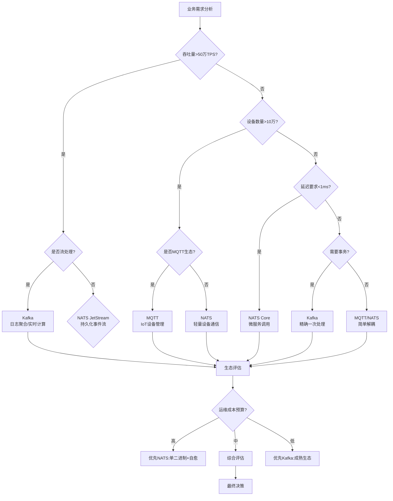

# 2.2 多场景架构决策图网

## 目录

- [2.2 多场景架构决策图网](#22-多场景架构决策图网)
  - [目录](#目录)
  - [2.2.1 动态决策网络](#221-动态决策网络)
  - [2.2.2 场景-架构权衡证明图](#222-场景-架构权衡证明图)
  - [2.2.3 三维场景决策立方体](#223-三维场景决策立方体)
  - [2.2.4 场景演进路径图](#224-场景演进路径图)
  - [2.2.5 场景化选型决策树（带证明）](#225-场景化选型决策树带证明)
  - [2.2.6 决策网络参考资源](#226-决策网络参考资源)
    - [决策理论参考](#决策理论参考)
    - [场景化选型参考](#场景化选型参考)

---

## 2.2.1 动态决策网络



## 2.2.2 场景-架构权衡证明图

```
┌─────────────────────────────────────────────────────────────┐
│                    场景驱动的架构权衡空间                      │
│                                                             │
│  一致性要求                                                  │
│      ↑                                                      │
│      │                                                      │
│  高  │  Kafka (ISR+磁盘) ←─────┐                          │
│      │         │               │                          │
│      │         │ 场景:金融交易/日志审计                  │
│      │         ↓               ↓                          │
│      │  MQTT QoS2 ←─────────→ NATS JetStream(Raft)     │
│      │         │               │                          │
│      │  场景:设备控制   场景:事件溯源                   │
│      │         │               │                          │
│  低  │  MQTT QoS0 ←─────────→ NATS Core (内存)         │
│      │         │               │                          │
│      │  场景:传感器数据 场景:服务网格                   │
│      │                           ↑                          │
│      └───────────────────────────┼─────────────────────────→ 性能要求
│                                  │                          │
│                              高延迟容忍                     │
└─────────────────────────────────────────────────────────────┘

证明逻辑：
1. 一致性轴：Kafka > NATS JetStream > MQTT QoS2 > MQTT QoS0 ≈ NATS Core
2. 性能轴：NATS Core > NATS JetStream > MQTT > Kafka
3. 最优选择位于场景需求向量与产品特性曲线的切点
```

## 2.2.3 三维场景决策立方体

```
          高吞吐量
             ↑
             │ Kafka
             │  ↗
             │ ╱  MQTT
  IoT场景 ←──┼─╲─────→ 微服务场景
             │   ↘
             │  NATS
             ↙
         低延迟/简单性

第三维：成熟度/生态
- Kafka: ★★★★★ (最成熟)
- MQTT: ★★★★☆ (协议标准，生态丰富)
- NATS: ★★★☆☆ (CNCF项目，快速发展)

决策规则：
IF 场景∈{日志,流处理} THEN 选择=Kafka
ELSE IF 场景∈{IoT,移动推送} THEN 选择=MQTT
ELSE IF 场景∈{微服务,边缘计算} THEN 选择=NATS
ELSE IF 场景∈{混合} THEN 选择=多协议网关
```

## 2.2.4 场景演进路径图

```
初期阶段(1000 QPS)
    ↓
单体应用 → 引入消息队列解耦
    ↓
选择：Redis PubSub / NATS Core
理由：简单、无需持久化、延迟最低

成长阶段(10万 QPS)
    ↓
微服务拆分 → 需要可靠事件流
    ↓
选择：Kafka分区 + NATS实时通信
架构：Kafka处理订单、支付等核心事件流
     NATS处理服务间调用、配置推送

成熟阶段(百万 QPS)
    ↓
多端接入(IoT+APP+Web) → 多协议需求
    ↓
选择：MQTT Broker + Kafka + NATS桥接
架构：
  MQTT Broker ←桥接→ Kafka (设备事件持久化)
  NATS ←桥接→ Kafka (实时指标聚合)

云原生阶段
    ↓
统一控制平面 → RobustMQ/多协议网关
```

## 2.2.5 场景化选型决策树（带证明）

```
START
│
├─▶ 场景识别
│   ├─ 输入：设备类型、数据规模、延迟要求、团队技能
│   └─ 输出：场景标签集 {IoT, 微服务, 大数据}
│
├─▶ 约束求解
│   ├─ 硬约束：协议兼容、资源限制、合规要求
│   ├─ 软约束：延迟<10ms、TPS>10万、可用性>99.9%
│   └─ 证明：满足所有硬约束的方案集非空
│
├─▶ 成本评估
│   ├─ 运维成本：NATS < MQTT < Kafka
│   ├─ 开发成本：生态成熟度 Kafka > MQTT > NATS
│   └─ 证明：总成本=ops_cost + dev_cost + risk_cost
│
└─▶ 最终决策
    ├─ 若 IoT∈场景 → 选择MQTT
    ├─ 若 大数据∈场景 → 选择Kafka
    ├─ 若 微服务∈场景 → 选择NATS
    └─ 若 混合场景 → 选择多协议方案或RobustMQ
```

## 2.2.6 决策网络参考资源

### 决策理论参考

- **多准则决策**: [Multi-Criteria Decision Analysis](https://en.wikipedia.org/wiki/Multi-criteria_decision_analysis)
- **架构决策记录**: [Architecture Decision Records](https://adr.github.io/)
- **技术选型框架**: [Technology Selection Framework](https://martinfowler.com/articles/technology-radar.html)

### 场景化选型参考

- **日志聚合场景**: [LinkedIn Kafka Use Cases](https://engineering.linkedin.com/kafka)
- **IoT场景**: [AWS IoT Core Best Practices](https://docs.aws.amazon.com/iot/latest/developerguide/best-practices.html)
- **微服务场景**: [NATS Microservices Patterns](https://docs.nats.io/nats-concepts/overview)

---

**参考来源**:

- 基于concept02.md内容整理
- 多准则决策分析理论
- LinkedIn、AWS等公司的实际案例
- 架构决策方法论和实践
