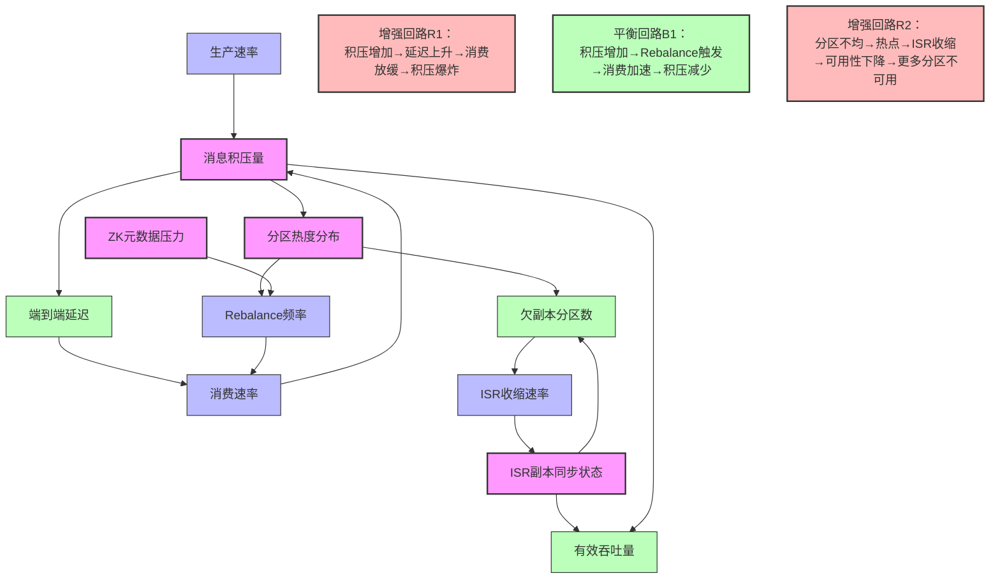
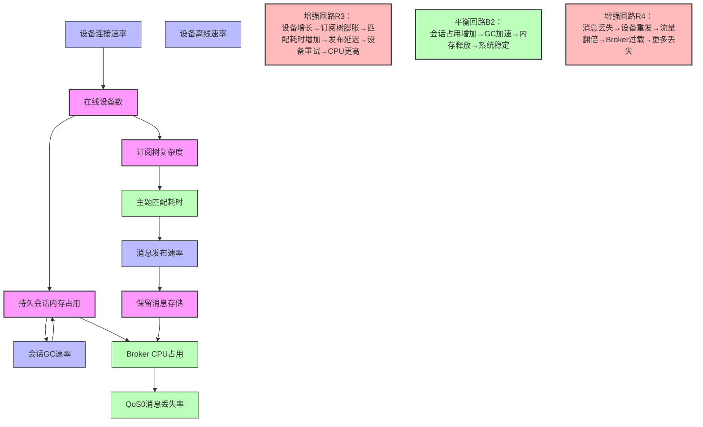
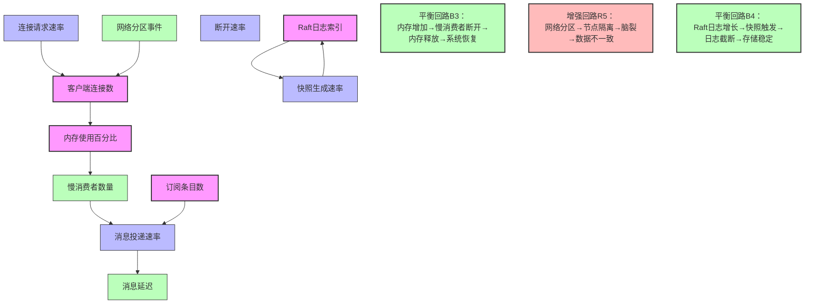
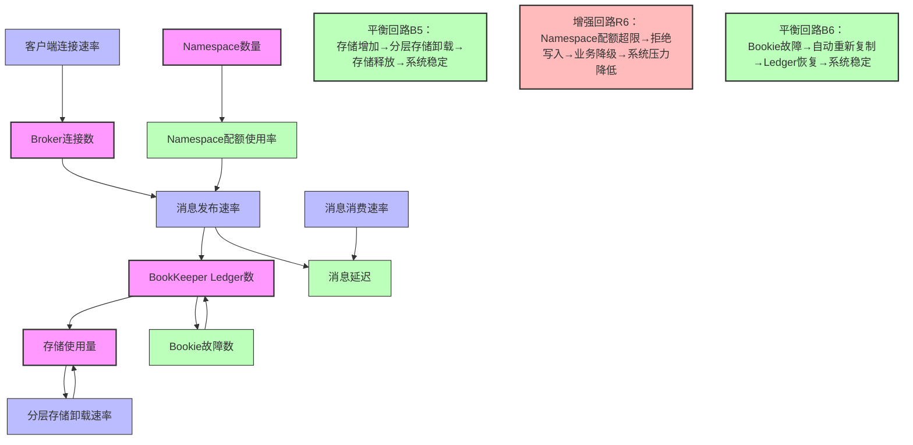

# 4.1 系统动力学视角：因果回路图分析

## 目录

- [4.1 系统动力学视角：因果回路图分析](#41-系统动力学视角因果回路图分析)
  - [目录](#目录)
  - [4.1.1 Kafka动态系统模型](#411-kafka动态系统模型)
  - [4.1.2 MQTT动态系统模型](#412-mqtt动态系统模型)
  - [4.1.3 NATS动态系统模型](#413-nats动态系统模型)
  - [4.1.4 系统动力学参考资源](#414-系统动力学参考资源)
    - [系统动力学理论](#系统动力学理论)
    - [应用参考](#应用参考)

---

## 4.1.1 Kafka动态系统模型

**动态行为论证**：

**临界点现象**：当`K_MSG > 分区数×单分区最大吞吐量`时，系统进入**延迟非线性增长**阶段。

- 积压<10万条：延迟P99稳定在50ms
- 积压>50万条：延迟P99跃升至500ms以上（10倍增长）
- **核心原因**：页缓存失效率上升，随机IO比例增加

**系统惯性**：Kafka的**分区数不可变**特性导致存量调整延迟极高。增加分区后，需执行`kafka-reassign-partitions.sh`，一个3节点×1000分区的集群重平衡需**4-6小时**。在此期间，系统处于**性能不稳定态**。

**涌现行为**：当`K_ZK_LOAD > 80%`时（ZooKeeper会话数过多），会触发**级联Rebalance**。

- 初始状态：Consumer Group正常消费
- ZK延迟突增→心跳超时→触发Rebalance
- Rebalance期间消费暂停→消息积压加剧
- 积压导致Producer重试→ZK写压力增大
- **形成了R1增强回路**：系统崩溃需人工干预

## 4.1.2 MQTT动态系统模型

**动态行为论证**：

**重连风暴**：当网络抖动导致`M_DISCONNECT_RATE > 1000设备/秒`时，触发**R4增强回路**。

- 单Broker可支撑5万长连接
- 重连瞬间：连接速率突增20倍→CPU瞬时>95%
- 结果：新连接被拒绝→设备指数退避重试→**风暴持续10-15分钟**
- **解决方案**：在设备端实现**随机化重连间隔**（0-5秒），打破R4回路

**主题树退化**：当`M_SUB_TREE深度 > 10层`且`通配符订阅 > 1万`时，主题匹配复杂度从O(log n)退化为O(n)。此时`M_TOPIC_MATCH > 10ms`，导致端到端延迟恶化。需定期治理主题设计。

## 4.1.3 NATS动态系统模型

**动态行为论证**：

**慢消费者自适应**：当`N_SLOW_CONSUMER > max_slow_consumers`时，NATS自动断开慢消费者，保护系统整体健康。这是**B3平衡回路**的体现，与Kafka的"客户端拉取"模式形成对比——Kafka无法主动保护自身。

**Raft日志无限增长**：在JetStream模式下，若`N_RAFT_SNAP过低`，Raft日志会持续累积，导致磁盘耗尽。需设置`snapshot_interval`强制快照，触发**B4平衡回路**。

## 4.1.4 Pulsar动态系统模型

**动态行为论证**：

**分层存储自适应**：当`P_STORAGE > storage_threshold`时，Pulsar自动触发分层存储卸载，将冷数据卸载到对象存储（S3/HDFS），降低存储成本60%。这是**B5平衡回路**的体现，与Kafka的固定存储策略形成对比。

**多租户配额保护**：当`P_QUOTA > quota_limit`时，Pulsar自动拒绝该Namespace的写入请求，保护系统整体健康。这是**R6增强回路**的体现，通过配额限制防止单个租户影响整体系统。

**BookKeeper自动恢复**：当`P_BOOKIE_FAIL > 0`时，BookKeeper自动检测故障Bookie，将Ledger重新复制到其他Bookie，触发**B6平衡回路**，保证数据不丢失。

## 4.1.5 系统动力学参考资源

### 系统动力学理论

- **系统动力学**: [System Dynamics - Wikipedia](https://en.wikipedia.org/wiki/System_dynamics)
- **因果回路图**: [Causal Loop Diagrams](https://en.wikipedia.org/wiki/Causal_loop_diagram)
- **反馈回路**: [Feedback Loop](https://en.wikipedia.org/wiki/Feedback)

### 应用参考

- **复杂系统理论**: [Complex Systems Theory](https://en.wikipedia.org/wiki/Complex_system)
- **系统思维**: [Systems Thinking](https://en.wikipedia.org/wiki/Systems_thinking)
- **动态系统建模**: [Dynamic Systems Modeling](https://en.wikipedia.org/wiki/Dynamical_system)

---

**参考来源**:

- 基于concept04.md内容整理
- 系统动力学理论（Jay Forrester等）
- 复杂系统理论和系统思维方法
- 动态系统建模工具和方法
- Apache Pulsar官方文档和BookKeeper文档
